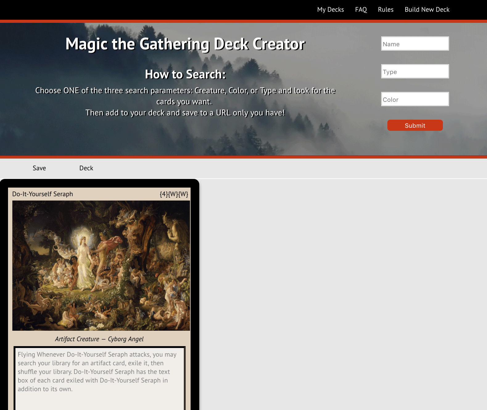
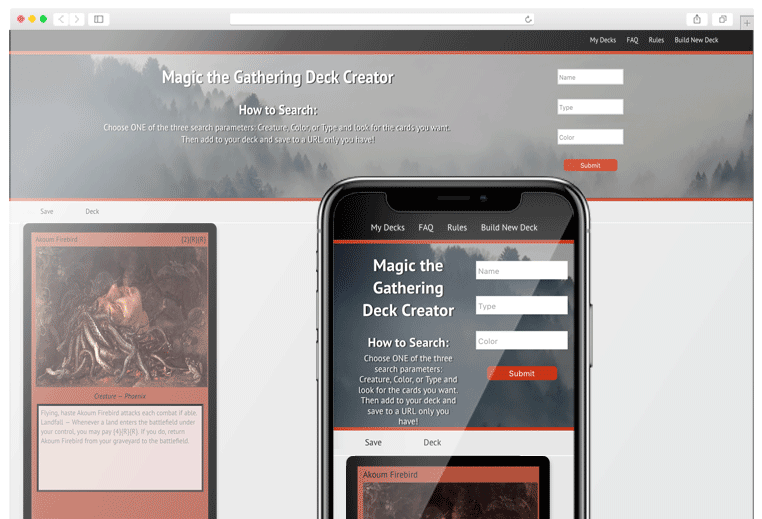

# Title: The Magic the Gathering Deck Creator

# Description

The app searches one of three parameters: "Card Name," "Card Color," or "Card Type" from a Magic the Gathering cards API. If you would like to use the API, it can be found here: 

https://docs.magicthegathering.io

The app returns a list of cards which users can scroll through and add to their "deck." If you find you've added a card you later decide you don't want, you can delete that card from your deck. The app allows users to check what cards are in the current deck before saving it. 

Users can create and edit their deck anonymously but in order to save, they must create an account. Once an account is created, all decks will be saved into the server and the user can return to view previously saved decks.

**The app is deployed here:** https://mtg-deck-creator.herokuapp.com/

# Tech Stack

**Front End**
React was used to create a single-page app using JSX
CSS3 for styling and HTML5

**Back End**
Node.js & Express were used to create routes
A PostgresQL database using Knex
JS & JQuery

# Key Components of Codebase

The client-side and backend are deployed on Heroku, seperately.
The database is hosted on ElephantSQL.
Postico is used to query and maintain the database.

# User Scenarios

This app is not meant for developers but for people who want to wax nostalgic about a classic analog game. If you would like to modify the app, feel free to clone the github and **npm install**

Everything is currently updated without vulnerabilities.
