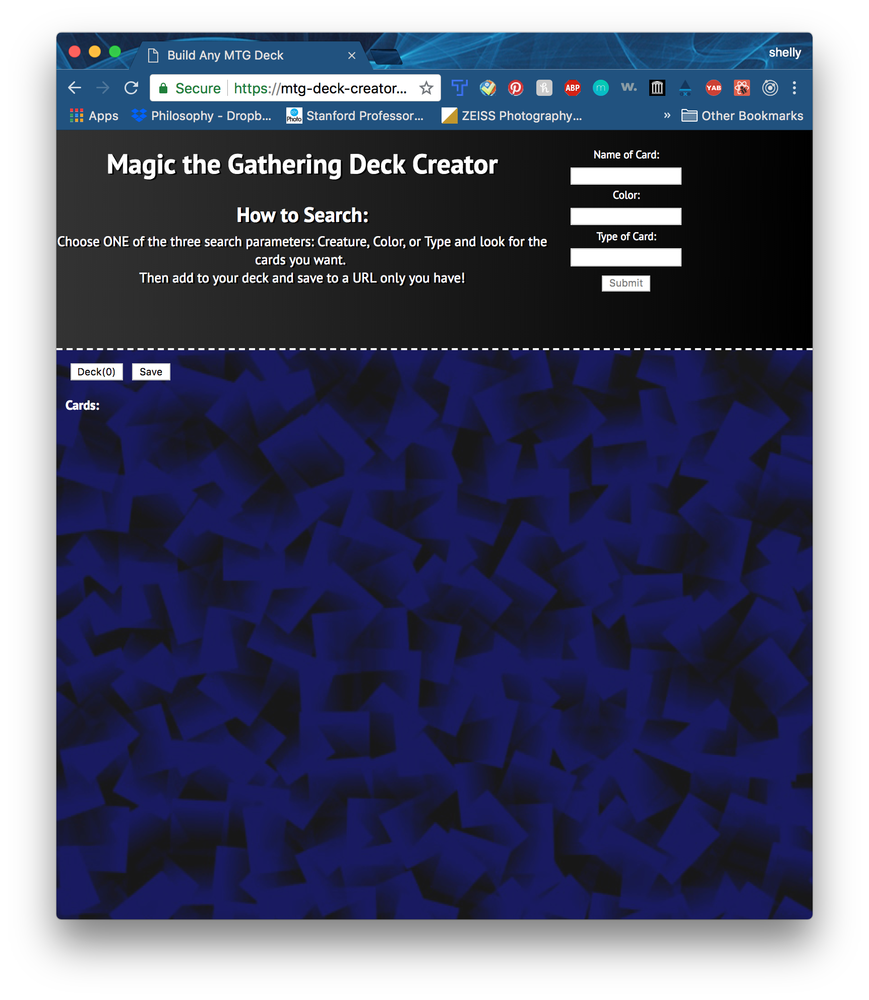
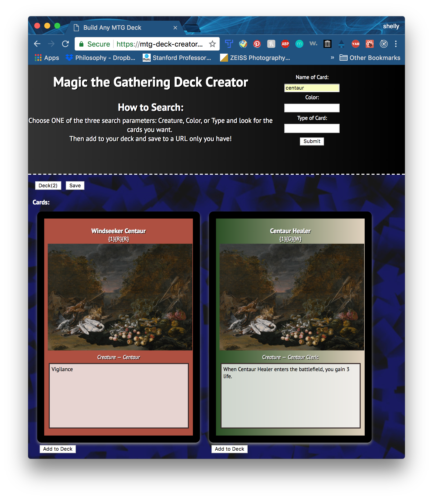

# Title: The Magic the Gathering Deck Creator

# Description

The app searches one of three parameters: "Card Name," "Card Color," or "Card Type" from a 3rd party Magic the Gathering cards API and returns a list of cards which users can scroll through and add to their "deck." If you find you've added a card you later decide you don't want, you can delete that card from your deck. The app allows your to check what cards are in your deck before saving it. Once saved, the deck cannot be edited, but you will be provided a unique Url where that deck now lives.

**The app is deployed here:** https://mtg-deck-creator.herokuapp.com/

# Tech Stack

**Front End**
React was used to create a single-page app using JSX
CSS for styling and HTML

**Back End**
Node.js & Express were used to create routes
A PostgresQL database with Knex
JS & JQuery

# Key Components of Codebase

The client-side and backend are deployed on Heroku, seperately.
The database is hosted on ElephantSQL.

# User Scenarios

This app is not meant for developers but for people who want to wax nostalgic about a classic analog game.
